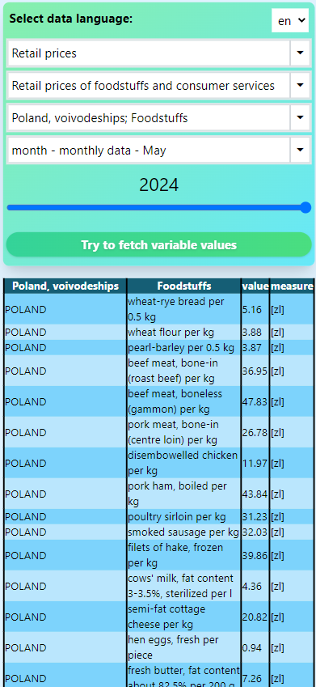

# GUS DBW UI
User friendly interface for [GUS](/https://stat.gov.pl/) Dziedzinowe Bazy Wiedzy API
<hr>
In this project I focus on API handling in Angular 2, more than design. 

## How to use
You fill out the form on the website and receive the result in a table.



## Main problem in development
- [This](https://api-dbw.stat.gov.pl/apidocs/index.html) documentation is not very helpful. I had to figure out how this api works by myself.
- Api routes are weirdly named.
- `/variable-section-periods` route does not have filter option, and it returns over 8000 records. I had to fetch it at app initialization and save it to localstorage to set up quick access. 

## Plans for the future
- pivot table
- charts
- `open ai` api to help with data analysis

## Installation
```bash
git clone http://github.com/KotKamil/GUS_DBW_UI.git
cd GUS_DBW_UI
npm install
```
